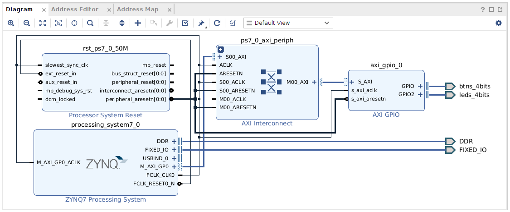
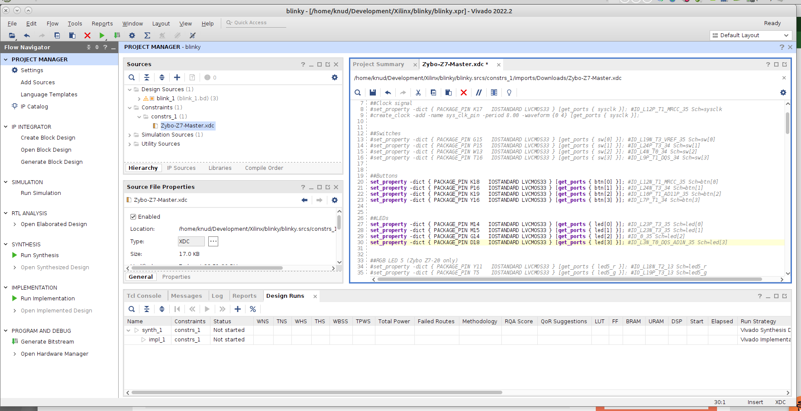

Rough reference, out of date, is https://www.instructables.com/Getting-Started-With-PetaLinux/

Main Xilinx ref https://docs.xilinx.com/r/en-US/ug1144-petalinux-tools-reference-guide/Overview

Download from https://support.xilinx.com/s/article/000034483?language=en_US 2022.2_PetaLinux_Package_List.xlsx to get dependencies list

First, set up for the installer.

`mkdir ~/PetaLinux`

install dependencies
```
sudo apt update
sudo apt upgrade
sudo apt install iproute2 gawk python3 python build-essential gcc git make net-tools libncurses5-dev tftpd zlib1g-dev libssl-dev flex bison libselinux1 gnupg wget git-core diffstat chrpath socat xterm autoconf libtool tar unzip texinfo zlib1g-dev gcc-multilib automake zlib1g:i386 screen pax gzip cpio python3-pip python3-pexpect xz-utils debianutils iputils-ping python3-git python3-jinja2 libegl1-mesa libsdl1.2-dev pylint3
```
Xilinx notes say to install `python` and `pylint3` but not found for Ubuntu 22.x

change to bash

```
bash
```

Download installer and attempt to install PetaLinux tools
```
cd Downloads
chmod +x petalinux-v2022.2-10141622-installer.run
./petalinux-v2022.2-10141622-installer.run  --dir ~/PetaLinux --platform="arm aarch64"
```

Warning about no tftp server

> Problem Description:
>
This warning message indicates that you do not have a TFTP service running on the workstation. Without a TFTP service, you cannot download Linux system images to the target system using the U-Boot network/TFTP capabilities. This warning can be ignored for other boot modes.
>
Solution:
>
Enable the TFTP service on your workstation. If you are unsure how to enable this service, contact your system administrator.

Install and run tftp server
```
sudo apt install tftpd-hpa
sudo systemctl status tftpd-hpa
```

Try install again

```
(base) knud 04:52:20 $./petalinux-v2022.2-10141622-installer.run  --dir ~/PetaLinux
INFO: Checking installation environment requirements...
WARNING: This is not a supported OS
INFO: Checking free disk space
INFO: Checking installed tools
INFO: Checking installed development libraries
INFO: Checking network and other services
INFO: Checking installer checksum...
INFO: Extracting PetaLinux installer...

LICENSE AGREEMENTS

PetaLinux SDK contains software from a number of sources.  Please review
the following licenses and indicate your acceptance of each to continue.

You do not have to accept the licenses, however if you do not then you may 
not use PetaLinux SDK.

Use PgUp/PgDn to navigate the license viewer, and press 'q' to close

Press Enter to display the license agreements
```

Accept EULAs and watch installer run...

Installer completed.

# PetaLinux on a Zybo

To get Linux up and running on a Zybo, there are three main steps

1. Prepare command line environment
2. Create a base project that defines the FPGA entities that are accessible from the Linux environment
3. Create the Linux bootloader and install on the target Zybo

The remainder of this guide is based on a Zybo Z7-20. Some minor changes are needed to support a Z7-10.

Before we start, we need the latest board definitions from Digilent. See this [guide](https://digilent.com/reference/programmable-logic/guides/installing-vivado-and-vitis) where we choose to get the definitions via Github
1. Scroll down to the section named "Install Digilent's Board Files"
2. Scroll down more to the section named "Appendix: Installing the Board Files via the "vivado-boards" Github Repository" and expand
3. Change directory to a location where you want the board definitions to live
   ```
   cd ~/Development
   ```
4. Clone the Digilent repo
   ```
   git clone https://github.com/Digilent/vivado-boards
   ```
5. Copy the `Vivado_init.tcl` file from the repo to the `~/.Xilinx/Vivado/` directory as instructed in the guide
6. Edit the `~./Xilinx/Vivado/Vivado_init.tcl` file as instructed
7. Now Vivado is ready to go


## 1. General PetaLinux Environment

For all command line development, source the PetaLinux and Vivado settings within bash and check env is set. The last line reflects the previous installation of Vitis under `xtools/Xilinx`
```
bash
cd ~
source PetaLinux/settings.sh
echo $PETALINUX
/home/knud/PetaLinux
source xtools/Xilinx/Vivado/2022.2/settings64.sh
```

## 2. Create a base project to define FPGA entities

***
The goal here is to create an `*.xsa` file that will eventually be used as part of a Linux-based board image. We start with this [reference](https://nuclearrambo.com/wordpress/running-petalinux-on-zynq-soc-from-scratch-zybo-board/) where we are refered to a [related reference](https://nuclearrambo.com/wordpress/programming-the-zynq-7000-with-vivado-2019-2-and-vitis/) that shows us how to create a bare metal project that connects a C program to a simple FPGA model.  
*** 


Make sure to install boards for Digilent 

https://digilent.com/reference/programmable-logic/guides/installing-vivado-and-vitis

Follow this [guide](https://nuclearrambo.com/wordpress/programming-the-zynq-7000-with-vivado-2019-2-and-vitis/) to create a base project making changes where needed for paths, etc. It is written for Vivado 2019.2, but we will use 2022.2.

We want to generate the HW interface in Vivado.
1. Open Vivado
2. Create a new project; here we give the name `blinky`. The project location is `/home/knud/Development/Xilinx` for this example
3. Choose an RTL project and none of the options
4. Make sure the target language is VHDL and and simulator language is Mixed. Don't add any source files
5. Don't add any constraint files (we'll do that later)
6. For the default part, switch to the Boards tab
	1. Select `digilentinc.com` for the vendor
		1. Select `Zybo Z7-20` for the part, and latest board rev
		2. If under the Status column it does not say installed, click the download icon under the Status column
7. The new project summary shows
	1. A new RTL project named `blinky` will be created
	2. No source files
	3. No constraints files
	4. The default part and product family for the new project:
		1. Default Board: Zybo Z7-20
		2. Default Part: xc7z020clg400-1
		3. Family: Zynq-7000
		4. Package: clg400
		5. Speed Grade: -1
6. Click Finish

As in the guide, we'll use Tcl commands to set up the board design

The following tcl commands work for Vivado 2022.2

Select the Tcl console

Now, add the Zynq Processing system IP block and the AXI GPIO block.  Execute each line below by itself in the Tcl console
```
create_bd_design "blinky"

create_bd_cell -type ip -vlnv xilinx.com:ip:processing_system7:5.5 processing_system7_0

apply_bd_automation -rule xilinx.com:bd_rule:processing_system7 -config {make_external "FIXED_IO, DDR" apply_board_preset "1" Master "Disable" Slave "Disable" }  [get_bd_cells processing_system7_0]

create_bd_cell -type ip -vlnv xilinx.com:ip:axi_gpio:2.0 axi_gpio_0
```
Run the Connection Automation
Now connect the DDR and the IO ports.
```
set_property -dict [list \
  CONFIG.GPIO2_BOARD_INTERFACE {leds_4bits} \
  CONFIG.GPIO_BOARD_INTERFACE {btns_4bits} \
] [get_bd_cells axi_gpio_0]

apply_bd_automation -rule xilinx.com:bd_rule:board -config { Board_Interface {btns_4bits ( 4 Buttons ) } Manual_Source {Auto}}  [get_bd_intf_pins axi_gpio_0/GPIO]

apply_bd_automation -rule xilinx.com:bd_rule:axi4 -config { Clk_master {Auto} Clk_slave {Auto} Clk_xbar {Auto} Master {/processing_system7_0/M_AXI_GP0} Slave {/axi_gpio_0/S_AXI} ddr_seg {Auto} intc_ip {New AXI Interconnect} master_apm {0}}  [get_bd_intf_pins axi_gpio_0/S_AXI]

regenerate_bd_layout

set_property -dict [list CONFIG.C_GPIO2_WIDTH {4} CONFIG.C_IS_DUAL {1} CONFIG.C_ALL_INPUTS {0} CONFIG.C_ALL_INPUTS_2 {1} CONFIG.GPIO_BOARD_INTERFACE {leds_4bits} CONFIG.GPIO2_BOARD_INTERFACE {btns_4bits} CONFIG.C_ALL_OUTPUTS {1}] [get_bd_cells axi_gpio_0]

apply_bd_automation -rule xilinx.com:bd_rule:board -config { Board_Interface {btns_4bits ( 4 Buttons ) } Manual_Source {Auto}}  [get_bd_intf_pins axi_gpio_0/GPIO2]

set_property name leds_4bits [get_bd_intf_ports btns_4bits_0]

set_property -dict [list \
  CONFIG.GPIO2_BOARD_INTERFACE {leds_4bits} \
  CONFIG.GPIO_BOARD_INTERFACE {btns_4bits} \
] [get_bd_cells axi_gpio_0]
```

The result should look like


Switch to the Sources tab and add the Zybo constraints file, which can be found [here](https://github.com/Digilent/digilent-xdc)

In our case, its `Zybo-Z7-Master.xdc`

Open the constraints and ake sure the buttons and leds are uncommented as shown below.


In Source view under Design Sources, right-click the `blinky` board design file and Generate Output Products. When finished right-click again and Create HDL Wrapper; Let Vivado manage wrapper and auto-update. (this takes a while, make tea)

Finally, click Generate Bitstream saving the design if prompted. Click Yes if there is a warning about no implementation results. When finished, it doesn't matter what is chosen for the final action, so just "Open Implemented Design".

When the bit stream generation, go to “**File > Export > Export hardware**” and make sure to include bit stream.

## Generate bare-metal C code to test board design (optional)

If you feel like checking that the buttons and leds work, close Vivado and launch Vitis (not Vitis HLS).

1. Start a new project by creating a new application project; **“File > New application project”.** Make sure your project name has no spaces.
2. Select "Create a new platform from hardware (XSA)" and navigate to the `blinky_wrapper.xsa`, which should be on the path `/home/knud/Development/Xilinx/blinky/blinky_wrapper.xsa` based on the steps above.
	1. We can leave the default platform name as `blinky_wrapper` or make it something else, it doesn't really matter.
3. Make the Application project name `blinky`
4. Create a new domain
5. Select Hello World as the template
6. Click finish

Change the Vitis view to Design (see upper right of main window).

In the Explorer, expand the `blinky_wrapper` and double-click the `platform.spr` file. Select the Hardware Specification view to show the details of the processor address map. Notice for `axi_gpio_0` the base address, which for this example is `0x41200000`.

In the Explorer, expand the `blinky_system` and `blinky` subsystem to expose the includes and src. Under src open the `helloworld.c` file and replace with the code below.

Source code in `helloworld.c`
```
#include <stdio.h>
#include "platform.h"
#include "xil_printf.h"
#include "xgpio.h"
#include "xil_io.h"
#include "sleep.h"
#define GPIO_BASE 0x41200000;

XGpio gpio;

#define BIT0	0x01
#define BIT1	0x02
#define BIT2	0x04
#define BIT3	0x08

int main()
{
 init_platform();
 XGpio gpio;
 u32 btn, led;

 if(XGpio_Initialize(&gpio, XPAR_GPIO_0_DEVICE_ID) == XST_DEVICE_NOT_FOUND) {
	 print("Bad XGpio init\n\r");
	 cleanup_platform();
	 return 0;
 }
 XGpio_SetDataDirection(&gpio, 2, 0x00000000); // set LED GPIO channel tristates to All Output
 XGpio_SetDataDirection(&gpio, 1, 0xFFFFFFFF); // set BTN GPIO channel tristates to All Input
 while (1)
 {
   XGpio_DiscreteWrite(&gpio, 2, BIT0);
   usleep(100000);
   XGpio_DiscreteWrite(&gpio, 2, BIT1);
   usleep(100000);
   XGpio_DiscreteWrite(&gpio, 2, BIT2);
   usleep(100000);
   XGpio_DiscreteWrite(&gpio, 2, BIT3);
   usleep(100000);
   btn = XGpio_DiscreteRead(&gpio, 1);
   xil_printf("\rbutton state: %08x\n", btn);
 }
 cleanup_platform();
 return 0;
}

```

Build a Debug version of the code.

Plug the Zybo into the computer via the USB cable.

Now create a Debug configuration based on Single Application Debug. Double click it and leave the defaults as is, then click Debug to load and run your code.

The debugger will halt at `init_platform`. Click the resume button and marvel at the blinky leds.

You can add a Vitis Serial console connected to the USB port and set to 115200 baud to see the results of pressing one or more buttons.
