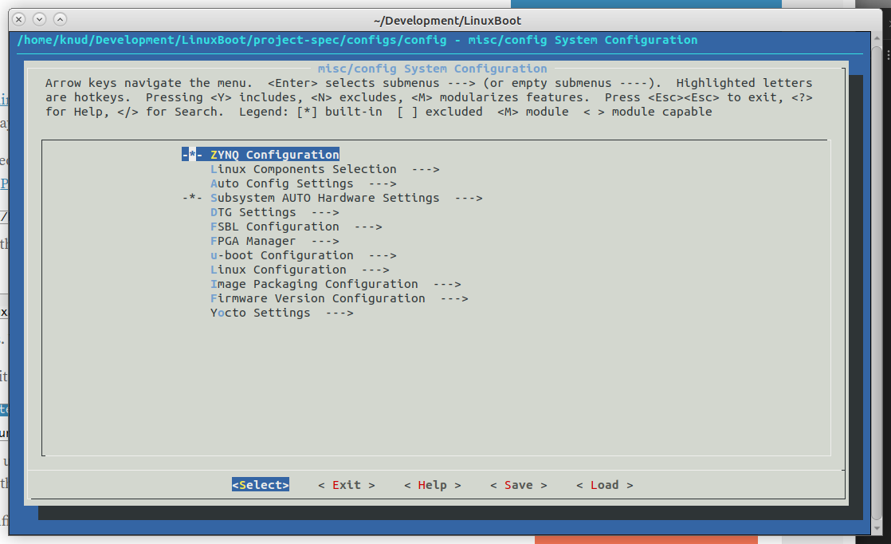
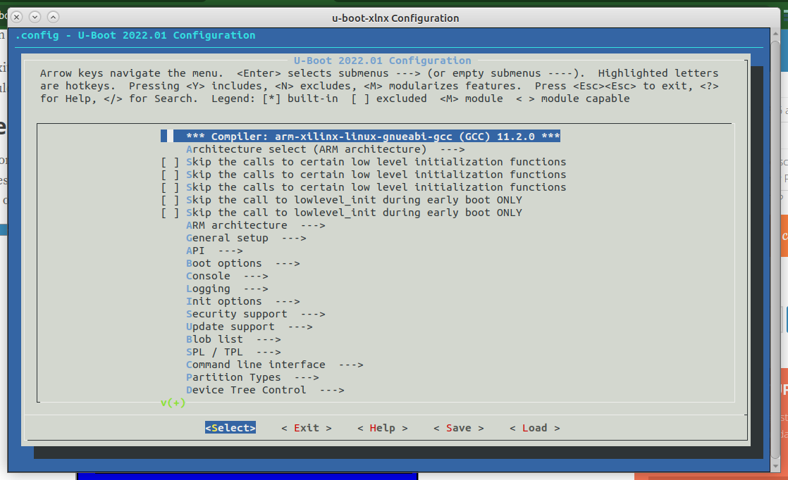
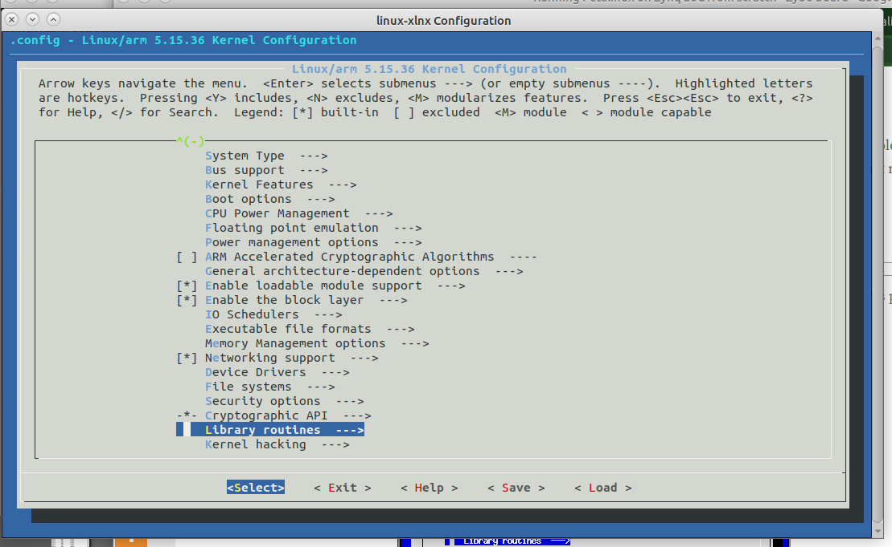
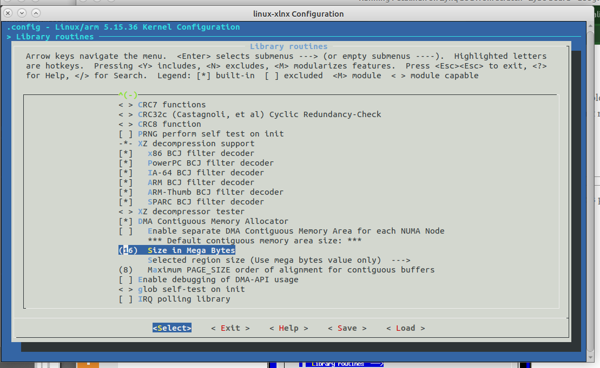
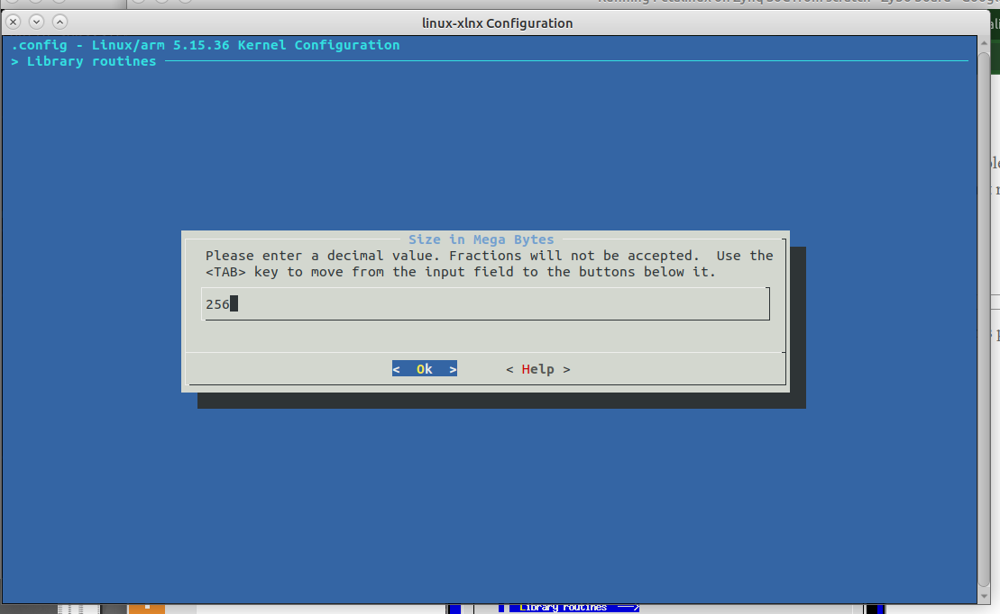
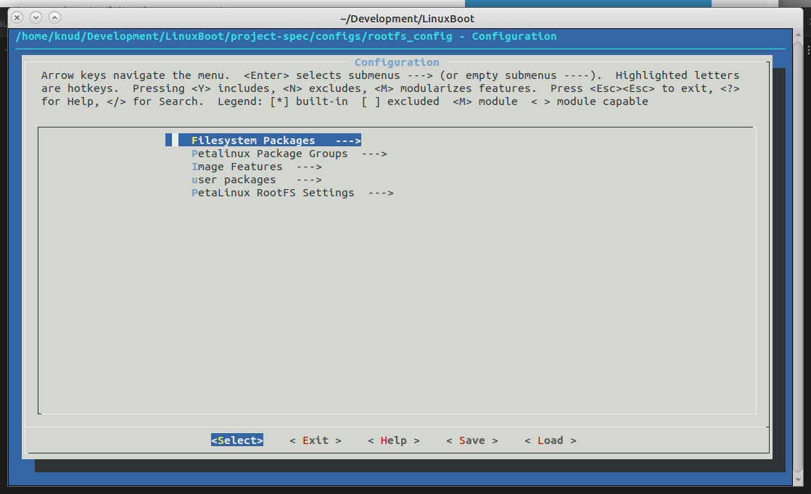
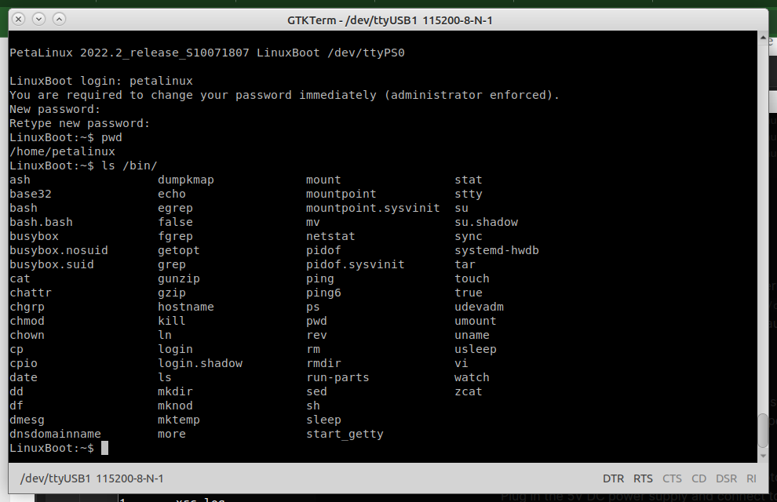

***
In Part 1 a bare metal program was implemented to control a simple FPGA-based system. Here we build on that to do the same but with a Linux-based OS. For that we will need the `*.xsa` file created in Part 1.
***

Main reference is https://nuclearrambo.com/wordpress/running-petalinux-on-zynq-soc-from-scratch-zybo-board/ . It is based on Vitis 2020.2, but should be mostly correct for 2022.2.

Main Xilinx ref https://docs.xilinx.com/r/en-US/ug1144-petalinux-tools-reference-guide/Overview

## To run PetaLinux stuff

For this step and others the PetaLinux install dir is `/home/knud/PetaLinux`, adjust for your installation.

Source the PetaLinux and Vivado settings within bash and check env is set.

( For some reason it seems an earlier version of PetaLinux had a `bin` directory, so the path in the online reference includes it. We don't have that...)

```
bash
cd ~
source PetaLinux/settings.sh
echo $PETALINUX
/home/knud/PetaLinux
source xtools/Xilinx/Vivado/2022.2/settings64.sh
```

# PetaLinux on a Zybo

To get Linux up and running on a Zybo, there are three main steps (we completed the first two in Part 1)

1. ~~Prepare command line environment~~
2. ~~Create a base project that defines the FPGA entities that are accessible from the Linux environment~~
3. Create the Linux bootloader and install on the target Zybo

The remainder of this guide is based on a Zybo Z7-20. Some minor changes are needed to support a Z7-10.

To make a project for Zybo,

***
**NOTE:** Don't do this part between the horizontal lines. Start after the next horizontal line.

Download BSP from https://github.com/Digilent/Petalinux-Zybo-Z7-20/releases/tag/v2017.4-3
(there may be newer releases, so check the tags in the repo)
```
cd Development
petalinux-create -t project -s /home/knud/Downloads/Petalinux-Zybo-Z7-20-2017.4-3.bsp
INFO: Create project: 
INFO: Projects: 
INFO: 	* Zybo-Z7-20
INFO: Has been successfully installed to /home/knud/Development/
INFO: New project successfully created in /home/knud/Development/
```
The new project is in `Zybo-Z7-20`.

If a different project folder name is desired, use the `-n` flag in the `petalinux-create` command to specify the name.
***
We will make a PetaLinux project in the `Development` folder; choose a root folder as you like.

```
cd ~/Development
petalinux-create -t project -n LinuxBoot --template zynq
cd LinuxBoot
```

## Git version control

Might as well put this under Git. The project created comes with a `.gitignore`, so nice!

Create blank repo named `PetaLinux2022.2_Zybo_example` on Github, no README, LICENSE.

```
echo "# PetaLinux2022.2_example" >> README.md
git init
git add .
git commit -m "first commit"
git branch -M main
git remote add origin https://github.com/StevenKnudsen/PetaLinux2022.2_Zybo_example.git
git push -u origin main
```

Now we have PetaLinux use the `*.xsa` file to configure the system.
```
petalinux-config --get-hw-description=/home/knud/Development/Xilinx/blinky/blinky_wrapper.xsa
```

This brings up the configuration window shown below.



Notice that Petalinux is all based on [Yocto project](https://www.yoctoproject.org/), which helps create embedded Linux distributions.

We won't dive into all the settings, just what we need for this simple example.

We do want to change the file system medium away from RAM to the SD card. Select `Image Packaging Configuration` and then `Root filesystem type` and change to `EXT4`. Then select `Exit`.

Select `Exit` again, select "Yes", and the configuration tool will set up all the defaults.

Next we configure u-boot using the command `petalinux-config -c u-boot`. A lot of stuff is done, so be patient. (in this case it's worth showing the output for reference).

When the u-boot configuration window comes up select `Exit`, select "Yes", and the u-boot configuration tool will set up all the defaults.

```
petalinux-config -c u-boot
[INFO] Sourcing buildtools
[INFO] Silentconfig project
[INFO] Sourcing build environment
[INFO] Generating kconfig for Rootfs
[INFO] Silentconfig rootfs
[INFO] Generating plnxtool conf
[INFO] Generating workspace directory
[INFO] Configuring: u-boot
[INFO] bitbake virtual/bootloader -c menuconfig
NOTE: Started PRServer with DBfile: /home/knud/Development/LinuxBoot/build/cache/prserv.sqlite3, Address: 127.0.0.1:33503, PID: 18827
WARNING: Host distribution "ubuntu-22.04" has not been validated with this version of the build system; you may possibly experience unexpected failures. It is recommended that you use a tested distribution.
Loading cache: 100% |                                                                                   | ETA:  --:--:--
Loaded 0 entries from dependency cache.
Parsing recipes: 100% |##################################################################################| Time: 0:00:52
Parsing of 4461 .bb files complete (0 cached, 4461 parsed). 6497 targets, 627 skipped, 1 masked, 0 errors.
NOTE: Resolving any missing task queue dependencies
NOTE: Fetching uninative binary shim file:///home/knud/Development/LinuxBoot/components/yocto/downloads/uninative/126f4f7f6f21084ee140dac3eb4c536b963837826b7c38599db0b512c3377ba2/x86_64-nativesdk-libc-3.4.tar.xz;sha256sum=126f4f7f6f21084ee140dac3eb4c536b963837826b7c38599db0b512c3377ba2 (will check PREMIRRORS first)
WARNING: Your host glibc version (2.35) is newer than that in uninative (2.34). Disabling uninative so that sstate is not corrupted.
Initialising tasks: 100% |###############################################################################| Time: 0:00:03
Checking sstate mirror object availability: 100% |#######################################################| Time: 0:00:02
Sstate summary: Wanted 144 Local 0 Network 11 Missed 133 Current 0 (7% match, 0% complete)
NOTE: Executing Tasks
NOTE: Tasks Summary: Attempted 653 tasks of which 107 didn't need to be rerun and all succeeded.

Summary: There were 2 WARNING messages shown.
[INFO] bitbake virtual/bootloader -c diffconfig
NOTE: Started PRServer with DBfile: /home/knud/Development/LinuxBoot/build/cache/prserv.sqlite3, Address: 127.0.0.1:41069, PID: 445296
WARNING: Host distribution "ubuntu-22.04" has not been validated with this version of the build system; you may possibly experience unexpected failures. It is recommended that you use a tested distribution.
Loading cache...done.
Loaded 6495 entries from dependency cache.
Parsing recipes...done.
Parsing of 4461 .bb files complete (4459 cached, 2 parsed). 6497 targets, 627 skipped, 1 masked, 0 errors.
NOTE: Resolving any missing task queue dependencies
NOTE: Fetching uninative binary shim file:///home/knud/Development/LinuxBoot/components/yocto/downloads/uninative/126f4f7f6f21084ee140dac3eb4c536b963837826b7c38599db0b512c3377ba2/x86_64-nativesdk-libc-3.4.tar.xz;sha256sum=126f4f7f6f21084ee140dac3eb4c536b963837826b7c38599db0b512c3377ba2 (will check PREMIRRORS first)
WARNING: Your host glibc version (2.35) is newer than that in uninative (2.34). Disabling uninative so that sstate is not corrupted.
Initialising tasks...done.
Sstate summary: Wanted 0 Local 0 Network 0 Missed 0 Current 0 (0% match, 0% complete)
NOTE: No setscene tasks
NOTE: Executing Tasks
NOTE: Running task 1 of 1 (/home/knud/Development/LinuxBoot/components/yocto/layers/meta-xilinx/meta-xilinx-core/recipes-bsp/u-boot/u-boot-xlnx_2022.2.bb:do_diffconfig)
NOTE: recipe u-boot-xlnx-v2021.01-xilinx-v2022.2+gitAUTOINC+b31476685d-r0: task do_diffconfig: Started
NOTE: recipe u-boot-xlnx-v2021.01-xilinx-v2022.2+gitAUTOINC+b31476685d-r0: task do_diffconfig: Succeeded
NOTE: Tasks Summary: Attempted 1 tasks of which 0 didn't need to be rerun and all succeeded.

Summary: There were 2 WARNING messages shown.

[INFO] Successfully configured u-boot
```



Now it's time to configure the kernel. Enter the command `petalinux-config -c kernel`.

In this case we have to change a setting, so when the settings UI comes up, scroll down until you see `Library Routines`. Hit enter, and modify the `Default contiguous memory area size` and make it `256`.







Select Yes, then select `Exit` for the next screens until prompted to save the configuration; select "Yes", and the kernel configuration tool will finish with a couple of warnings.

```
petalinux-config -c kernel
[INFO] Sourcing buildtools
[INFO] Silentconfig project
[INFO] Sourcing build environment
[INFO] Generating kconfig for Rootfs
[INFO] Silentconfig rootfs
[INFO] Generating plnxtool conf
[INFO] Generating workspace directory
[INFO] Configuring: kernel
[INFO] bitbake virtual/kernel -c cleansstate
NOTE: Started PRServer with DBfile: /home/knud/Development/LinuxBoot/build/cache/prserv.sqlite3, Address: 127.0.0.1:39939, PID: 457389
WARNING: Host distribution "ubuntu-22.04" has not been validated with this version of the build system; you may possibly experience unexpected failures. It is recommended that you use a tested distribution.
Loading cache: 100% |####################################################################################| Time: 0:00:00
Loaded 6495 entries from dependency cache.
Parsing recipes: 100% |##################################################################################| Time: 0:00:01
Parsing of 4461 .bb files complete (4459 cached, 2 parsed). 6497 targets, 627 skipped, 1 masked, 0 errors.
NOTE: Resolving any missing task queue dependencies
NOTE: Fetching uninative binary shim file:///home/knud/Development/LinuxBoot/components/yocto/downloads/uninative/126f4f7f6f21084ee140dac3eb4c536b963837826b7c38599db0b512c3377ba2/x86_64-nativesdk-libc-3.4.tar.xz;sha256sum=126f4f7f6f21084ee140dac3eb4c536b963837826b7c38599db0b512c3377ba2 (will check PREMIRRORS first)
WARNING: Your host glibc version (2.35) is newer than that in uninative (2.34). Disabling uninative so that sstate is not corrupted.
Initialising tasks: 100% |###############################################################################| Time: 0:00:01
Sstate summary: Wanted 0 Local 0 Network 0 Missed 0 Current 0 (0% match, 0% complete)
NOTE: No setscene tasks
NOTE: Executing Tasks
NOTE: Tasks Summary: Attempted 3 tasks of which 0 didn't need to be rerun and all succeeded.

Summary: There were 2 WARNING messages shown.
[INFO] bitbake virtual/kernel -c menuconfig
NOTE: Started PRServer with DBfile: /home/knud/Development/LinuxBoot/build/cache/prserv.sqlite3, Address: 127.0.0.1:45731, PID: 457954
WARNING: Host distribution "ubuntu-22.04" has not been validated with this version of the build system; you may possibly experience unexpected failures. It is recommended that you use a tested distribution.
Loading cache: 100% |####################################################################################| Time: 0:00:00
Loaded 6495 entries from dependency cache.
Parsing recipes: 100% |##################################################################################| Time: 0:00:01
Parsing of 4461 .bb files complete (4459 cached, 2 parsed). 6497 targets, 627 skipped, 1 masked, 0 errors.
NOTE: Resolving any missing task queue dependencies
NOTE: Fetching uninative binary shim file:///home/knud/Development/LinuxBoot/components/yocto/downloads/uninative/126f4f7f6f21084ee140dac3eb4c536b963837826b7c38599db0b512c3377ba2/x86_64-nativesdk-libc-3.4.tar.xz;sha256sum=126f4f7f6f21084ee140dac3eb4c536b963837826b7c38599db0b512c3377ba2 (will check PREMIRRORS first)
WARNING: Your host glibc version (2.35) is newer than that in uninative (2.34). Disabling uninative so that sstate is not corrupted.
Initialising tasks: 100% |###############################################################################| Time: 0:00:01
Sstate summary: Wanted 10 Local 0 Network 1 Missed 9 Current 86 (10% match, 90% complete)
NOTE: Executing Tasks
NOTE: Tasks Summary: Attempted 438 tasks of which 426 didn't need to be rerun and all succeeded.

Summary: There were 2 WARNING messages shown.
[INFO] bitbake virtual/kernel -c diffconfig
NOTE: Started PRServer with DBfile: /home/knud/Development/LinuxBoot/build/cache/prserv.sqlite3, Address: 127.0.0.1:35905, PID: 463975
WARNING: Host distribution "ubuntu-22.04" has not been validated with this version of the build system; you may possibly experience unexpected failures. It is recommended that you use a tested distribution.
Loading cache...done.
Loaded 6495 entries from dependency cache.
Parsing recipes...done.
Parsing of 4461 .bb files complete (4459 cached, 2 parsed). 6497 targets, 627 skipped, 1 masked, 0 errors.
NOTE: Resolving any missing task queue dependencies
NOTE: Fetching uninative binary shim file:///home/knud/Development/LinuxBoot/components/yocto/downloads/uninative/126f4f7f6f21084ee140dac3eb4c536b963837826b7c38599db0b512c3377ba2/x86_64-nativesdk-libc-3.4.tar.xz;sha256sum=126f4f7f6f21084ee140dac3eb4c536b963837826b7c38599db0b512c3377ba2 (will check PREMIRRORS first)
WARNING: Your host glibc version (2.35) is newer than that in uninative (2.34). Disabling uninative so that sstate is not corrupted.
Initialising tasks...done.
Sstate summary: Wanted 9 Local 0 Network 1 Missed 8 Current 56 (11% match, 87% complete)
NOTE: Executing Tasks
NOTE: Running task 300 of 300 (/home/knud/Development/LinuxBoot/components/yocto/layers/meta-xilinx/meta-xilinx-core/recipes-kernel/linux/linux-xlnx_2022.2.bb:do_diffconfig)
NOTE: recipe linux-xlnx-5.15.36+gitAUTOINC+19984dd147-r0: task do_diffconfig: Started
Config fragment has been dumped into:
 /home/knud/Development/LinuxBoot/build/tmp/work/zynq_generic-xilinx-linux-gnueabi/linux-xlnx/5.15.36+gitAUTOINC+19984dd147-r0/fragment.cfg
NOTE: recipe linux-xlnx-5.15.36+gitAUTOINC+19984dd147-r0: task do_diffconfig: Succeeded
NOTE: Tasks Summary: Attempted 300 tasks of which 299 didn't need to be rerun and all succeeded.

Summary: There were 2 WARNING messages shown.

generate_bbappend /home/knud/Development/LinuxBoot/build/tmp/work/zynq_generic-xilinx-linux-gnueabi/linux-xlnx/5.15.36+gitAUTOINC+19984dd147-r0/user_2023-02-10-03-06-00.cfg /home/knud/Development/LinuxBoot/project-spec/meta-user/
[INFO] recipetool appendsrcfile -wW /home/knud/Development/LinuxBoot/project-spec/meta-user/ virtual/kernel /home/knud/Development/LinuxBoot/build/tmp/work/zynq_generic-xilinx-linux-gnueabi/linux-xlnx/5.15.36+gitAUTOINC+19984dd147-r0/user_2023-02-10-03-06-00.cfg
NOTE: Starting bitbake server...
NOTE: Started PRServer with DBfile: /home/knud/Development/LinuxBoot/build/cache/prserv.sqlite3, Address: 127.0.0.1:44017, PID: 464521
Loading cache...done.
Loaded 6495 entries from dependency cache.
Parsing recipes...done.
Parsing of 4461 .bb files complete (4459 cached, 2 parsed). 6497 targets, 627 skipped, 1 masked, 0 errors.

Summary: There was 1 WARNING message shown.
NOTE: Writing append file /home/knud/Development/LinuxBoot/project-spec/meta-user/recipes-kernel/linux/linux-xlnx_%.bbappend
NOTE: Copying /home/knud/Development/LinuxBoot/build/tmp/work/zynq_generic-xilinx-linux-gnueabi/linux-xlnx/5.15.36+gitAUTOINC+19984dd147-r0/user_2023-02-10-03-06-00.cfg to /home/knud/Development/LinuxBoot/project-spec/meta-user/recipes-kernel/linux/linux-xlnx/user_2023-02-10-03-06-00.cfg
[INFO] bitbake virtual/kernel -c cleansstate
NOTE: Started PRServer with DBfile: /home/knud/Development/LinuxBoot/build/cache/prserv.sqlite3, Address: 127.0.0.1:43473, PID: 464606
WARNING: Host distribution "ubuntu-22.04" has not been validated with this version of the build system; you may possibly experience unexpected failures. It is recommended that you use a tested distribution.
Loading cache: 100% |####################################################################################| Time: 0:00:00
Loaded 6495 entries from dependency cache.
Parsing recipes: 100% |##################################################################################| Time: 0:00:01
Parsing of 4461 .bb files complete (4458 cached, 3 parsed). 6497 targets, 627 skipped, 1 masked, 0 errors.
NOTE: Resolving any missing task queue dependencies
NOTE: Fetching uninative binary shim file:///home/knud/Development/LinuxBoot/components/yocto/downloads/uninative/126f4f7f6f21084ee140dac3eb4c536b963837826b7c38599db0b512c3377ba2/x86_64-nativesdk-libc-3.4.tar.xz;sha256sum=126f4f7f6f21084ee140dac3eb4c536b963837826b7c38599db0b512c3377ba2 (will check PREMIRRORS first)
WARNING: Your host glibc version (2.35) is newer than that in uninative (2.34). Disabling uninative so that sstate is not corrupted.
Initialising tasks: 100% |###############################################################################| Time: 0:00:03
Sstate summary: Wanted 0 Local 0 Network 0 Missed 0 Current 0 (0% match, 0% complete)
NOTE: No setscene tasks
NOTE: Executing Tasks
NOTE: Tasks Summary: Attempted 3 tasks of which 0 didn't need to be rerun and all succeeded.

Summary: There were 2 WARNING messages shown.
[INFO] Successfully configured kernel

```

Finally it's time to configure the root file system. Enter the command 
```
petalinux-config -c rootfs
```
A configuration screen will come up as shown below.

From the guide, 

> This configuration wizard allows us to modify what goes inside our Linux operating system. For example, we can configure it to compile certain packages and basic tools like Python, SSH, Apache webserver and so on. You get the point, the usual Linux stuff. Remember, that Linux OS in itself is basically a scheduler and handles all sorts of things from protecting memory locations, running applications, interacting with external hardware and what not. Everything else is an added bonus. The less “bonus content” you ask for, the smaller its size gets. Bare linux OS can sit happily in a tiny area as small as a few mega bytes. Its the “bonus content” or rather the applications that cause a inflation in its size.



Here's what I configured
1. Filesystem packages -> admin -> sudo
2. Filesystem packages -> base -> busybox -> busybox
3. Filesystem packages -> base -> shell -> bash
4. Filesystem packages -> console -> network -> wget -> wget
5. Filesystem packages -> misc -> packagegroup-core-buildessential -> packagegroup-core-buildessential
6. Filesystem packages -> misc -> packagegroup-core-tools-debug -> packagegroup-core-tools-debug
7. Filesystem packages -> misc -> python3 -> python3
8. Filesystem packages -> misc -> python3 -> python3-core
9. Filesystem packages -> misc -> python3 -> python3-math
10. Filesystem packages -> misc -> python3 -> libpython3
11. Filesystem packages -> misc -> python3 -> python3-dev
12. Petalinux Package Groups -> packagegroup-petalinux -> packagegroup-petalinux
13. Petalinux Package Groups -> packagegroup-petalinux-audio -> packagegroup-petalinux-audio
14. Petalinux Package Groups -> packagegroup-petalinux-networking-stack -> packagegroup-petalinux-networking-stack
15. Petalinux Package Groups -> packagegroup-petalinux-python-modules -> packagegroup-petalinux-python-modules
16. Petalinux Package Groups -> packagegroup-petalinux-utils -> packagegroup-petalinux-python-utils
17. user packages -> gpio-demo
18. user packages -> peekpoke

Select `Exit` for the next screens until prompted to save the configuration; select "Yes", and the rootfs configuration tool will finish.

***
**Note:** There are various package recipes available at https://github.com/Xilinx/meta-petalinux/tree/master/recipes-core 
***


```
petalinux-config -c rootfs
[INFO] Sourcing buildtools
[INFO] Silentconfig project
[INFO] Generating kconfig for Rootfs
[INFO] Menuconfig rootfs
configuration written to /home/knud/Development/LinuxBoot/project-spec/configs/rootfs_config

*** End of the configuration.
```

Build the Linux system. This takes a long time - <span style="color:pink">There are > 4200 tasks!!!</span>

```
petalinux-build
[INFO] Sourcing buildtools
[INFO] Building project
[INFO] Sourcing build environment
[INFO] Generating workspace directory
INFO: bitbake petalinux-image-minimal
NOTE: Started PRServer with DBfile: /home/knud/Development/LinuxBoot/build/cache/prserv.sqlite3, Address: 127.0.0.1:44411, PID: 468433
WARNING: Host distribution "ubuntu-22.04" has not been validated with this version of the build system; you may possibly experience unexpected failures. It is recommended that you use a tested distribution.
Loading cache: 100% |                                                                                   | ETA:  --:--:--
Loaded 0 entries from dependency cache.
Parsing recipes: 100% |##################################################################################| Time: 0:00:37
Parsing of 4461 .bb files complete (0 cached, 4461 parsed). 6497 targets, 627 skipped, 1 masked, 0 errors.
NOTE: Resolving any missing task queue dependencies
NOTE: Fetching uninative binary shim file:///home/knud/Development/LinuxBoot/components/yocto/downloads/uninative/126f4f7f6f21084ee140dac3eb4c536b963837826b7c38599db0b512c3377ba2/x86_64-nativesdk-libc-3.4.tar.xz;sha256sum=126f4f7f6f21084ee140dac3eb4c536b963837826b7c38599db0b512c3377ba2 (will check PREMIRRORS first)
WARNING: Your host glibc version (2.35) is newer than that in uninative (2.34). Disabling uninative so that sstate is not corrupted.
Initialising tasks: 100% |###############################################################################| Time: 0:00:04
Checking sstate mirror object availability: 100% |#######################################################| Time: 0:00:51
Sstate summary: Wanted 1470 Local 0 Network 1061 Missed 409 Current 121 (72% match, 74% complete)
Removing 1 stale sstate objects for arch zynq_generic: 100% |############################################| Time: 0:00:00
NOTE: Executing Tasks
NOTE: Tasks Summary: Attempted 4247 tasks of which 2832 didn't need to be rerun and all succeeded.

Summary: There were 2 WARNING messages shown.
INFO: Failed to copy built images to tftp dir: /tftpboot
[INFO] Successfully built project

```

Once it's done building, we package it together with one last command.

```
petalinux-package --boot --force --fsbl images/linux/zynq_fsbl.elf --fpga images/linux/system.bit --u-boot
[INFO] Sourcing buildtools
INFO: Getting system flash information...
INFO: File in BOOT BIN: "/home/knud/Development/LinuxBoot/images/linux/zynq_fsbl.elf"
INFO: File in BOOT BIN: "/home/knud/Development/LinuxBoot/images/linux/system.bit"
INFO: File in BOOT BIN: "/home/knud/Development/LinuxBoot/images/linux/u-boot.elf"
INFO: File in BOOT BIN: "/home/knud/Development/LinuxBoot/images/linux/system.dtb"
INFO: Generating zynq binary package BOOT.BIN...


****** Xilinx Bootgen v2022.2
  **** Build date : Sep 26 2022-06:24:42
    ** Copyright 1986-2022 Xilinx, Inc. All Rights Reserved.

[WARNING]: Partition zynq_fsbl.elf.0 range is overlapped with partition system.bit.0 memory range
[WARNING]: Partition system.bit.0 range is overlapped with partition system.dtb.0 memory range

[INFO]   : Bootimage generated successfully

INFO: Binary is ready.
WARNING: Unable to access the TFTPBOOT folder /tftpboot!!!
WARNING: Skip file copy to TFTPBOOT folder!!!
```

It's okay that the TFTPBOOT folder was not found.

The `rootfs.tar.gz` image can be found under `images/linux/`

```
ls -l images/linux/
total 217428
-rw-rw-r-- 1 knud knud  5136112 Feb  9 20:43 BOOT.BIN
-rw-rw-r-- 1 knud knud      285 Feb  9 20:43 bootgen.bif
-rw-r--r-- 1 knud knud     2776 Feb  9 20:29 boot.scr
-rw-r--r-- 1 knud knud     7320 Feb  9 20:10 config
-rw-r--r-- 1 knud knud 19778388 Feb  9 20:38 image.ub
drwxr-xr-x 2 knud knud     4096 Feb  9 20:29 pxelinux.cfg
-rw-r--r-- 1 knud knud 29186560 Feb  9 20:37 rootfs.cpio
-rw-r--r-- 1 knud knud 15216908 Feb  9 20:37 rootfs.cpio.gz
-rw-r--r-- 1 knud knud 15216972 Feb  9 20:37 rootfs.cpio.gz.u-boot
-rw-r--r-- 1 knud knud 67108864 Feb  9 20:37 rootfs.ext4
-rw-r--r-- 1 knud knud 17825792 Feb  9 20:37 rootfs.jffs2
-rw-r--r-- 1 knud knud    18477 Feb  9 20:37 rootfs.manifest
-rw-r--r-- 1 knud knud 15318880 Feb  9 20:37 rootfs.tar.gz
-rw-r--r-- 1 knud knud  4045674 Feb  9 19:39 system.bit
-rw-r--r-- 1 knud knud    19565 Feb  9 20:28 system.dtb
-rwxr-xr-x 1 knud knud   966664 Feb  9 20:30 u-boot.bin
-rw-r--r-- 1 knud knud   986229 Feb  9 20:30 u-boot-dtb.bin
-rw-r--r-- 1 knud knud  1052192 Feb  9 20:30 u-boot-dtb.elf
-rwxr-xr-x 1 knud knud  7261088 Feb  9 20:30 u-boot.elf
-rw-r--r-- 1 knud knud  4539856 Feb  9 20:38 uImage
-rw-r--r-- 1 knud knud 13922724 Feb  9 20:38 vmlinux
-rw-r--r-- 1 knud knud  4539792 Feb  9 20:38 zImage
-rw-r--r-- 1 knud knud   452976 Feb  9 20:30 zynq_fsbl.elf
```

As per the guide, prepare an SD card with a fat32 partion at least 512 MB and a second ext4 partition. Mount both partions, which on Ubuntu will be under the `/media/<your user name>`. Below I had not bothered to make the directories owned by my user, I just sudo'd the copy commands.

Expand the rootfs archive on to the ext4 partition (the mount point will be different for your system); 
```
sudo tar -xzvf images/linux/rootfs.tar.gz -C /media/knud/1db7f7f0-c997-46a7-ba17-3fc8d43b912f/
sync
```

Copy the following files to the fat32 partition (the mount point will be different for your system);

1.  BOOT.bin
2.  boot.scr
3.  image.ub

```
sudo cp images/linux/BOOT.BIN /media/knud/0446-871D/
sudo cp images/linux/boot.scr /media/knud/0446-871D/
sudo cp images/linux/image.ub /media/knud/0446-871D/
```

Dismount and eject the SD card.

### USB Terminal setup

Before we boot Linux on the Zybo, set up a terminal for serial interactions. I chose `gtkterm`. Once the board is booting, it will show up as `/dev/ttyUSB0`. Start `gtkterm` and connect using the default settings and a speed of 115200 baud.

### First Boot

On the Zybo board insert the SD card. It is best to power it from the 5V barrel connection, so  change jumper JP6 to Wall. Then change jumper JP5 to SD to enable booting from the SD card.

Connect the Zybo micro-USB port to your laptop's USB port (this is the serial connection). Plug in the 5V DC power supply and connect to the Zybo. PGOOD and DONE LEDs should come on as the board boots. 

Connect `gtkterm` and wait for the boot process to end.

The entire [boot process](PetaLinux_boot.txt) can be seen in this file (actually, reboot).

Eventually a login prompt appears; enter the username `petalinux` and when prompted your password. Since the configuration of the image is set to always prompted for a new password at login, you'll have to do that. (See [Adding Extra Users to the PetaLinux System](https://docs.xilinx.com/r/en-US/ug1144-petalinux-tools-reference-guide/Adding-Extra-Users-to-the-PetaLinux-System) for how to change this).

***
**NOTE:** Yocto has disabled root login
***



### Playing with GPIOs

We can find the base address of the GPIO buttons as follows
```
LinuxBoot:~$ cat /sys/class/gpio/gpiochip1016/label 
41200000.gpio
```
To see if a button is pressed, while pressing one or more buttons enter
```
LinuxBoot:~$ sudo devmem 0x41200000 8
0x02
```
which is the output when pressing BTN1.

To control the LEDS, we remember they are in channel 2, so offset from the base address. To turn on LD0 enter
```
LinuxBoot:~$ sudo devmem 0x41200008 8 0x1
```

To turn on all 4, enter
```
LinuxBoot:~$ sudo devmem 0x41200008 8 0xF
```

We included `gpio-demo` in the configuration. Let's try it.

```
LinuxBoot:~$ gpio-demo
Usage: gpio-demo [-g GPIO_BASE] COMMAND
	where COMMAND is one of:
		-i		Input value from GPIO and print it
		-o	VALUE	Output value to GPIO
		-c		Cylon test pattern
		-k		 KIT test pattern
	GPIO_BASE indicates which GPIO chip to talk to (The number can be 
	found at /sys/class/gpio/gpiochipN).
	The highest gpiochipN is the first gpio listed in the dts file, 
	and the lowest gpiochipN is the last gpio listed in the dts file.
	E.g.If the gpiochip240 is the LED_8bit gpio, and I want to output '1' 
	to the LED_8bit gpio, the command should be:
		gpio-demo -g 240 -o 1

	gpio-demo written by Xilinx Inc.

LinuxBoot:~$ ls /sys/class/gpio/
export	gpiochip1016  gpiochip898  unexport
LinuxBoot:~$ 
```

So, as above, we are using the 1016 chip.

```
sudo gpio-demo -g 1016 -i
0x00000000
LinuxBoot:~$
```

shows that no buttons are pressed, no LEDs are on. Let's turn on LD1 and press BTN3.

```
sudo gpio-demo -g 1016 -o 0x20
LinuxBoot:~$ sudo gpio-demo -g 1016 -i
0x00000028
LinuxBoot:~$ 
```
BT3 three corresponds to the 3rd bit in the first nibble, and LD1 to the second bit in the second nibble.

Sadly, the Cyclon and Kit demos don't really work as the LEDs cycle too fast :-(

However, we can fix that by fixing the source code, which is part of the Yocto recipe for Zybos.

On you laptop, change to your development directory and clone the Petalinux-Zybo project.
```
git clone https://github.com/Digilent/Petalinux-Zybo.git
```

Navigate to where the demo programs reside. Mount the SD card on your laptop and copy the all the demo (`gpio-demo, peekpoke`) files over to your `petalinux` account.
```
cd Petalinux-Zybo/Zybo/project-spec/meta-user/recipes-apps
cp -dpR * /media/knud/1db7f7f0-c997-46a7-ba17-3fc8d43b912f/home/petalinux
```

(your mount point will be different than above.)

Then have a look at the gpio-demo.c source file and change the Cyclon and Kit demos so they work (an exercise for the interested reader :-)